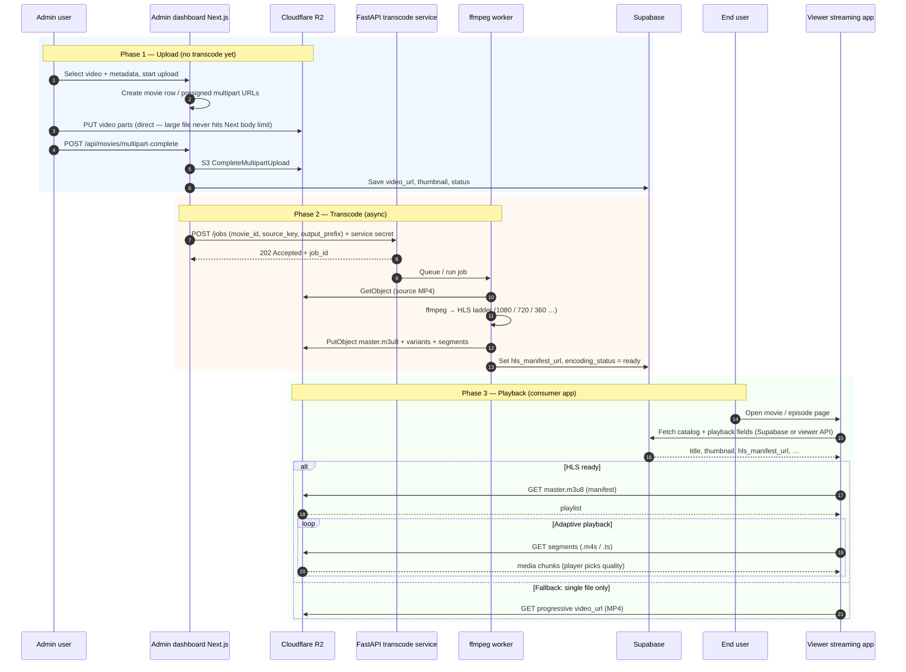
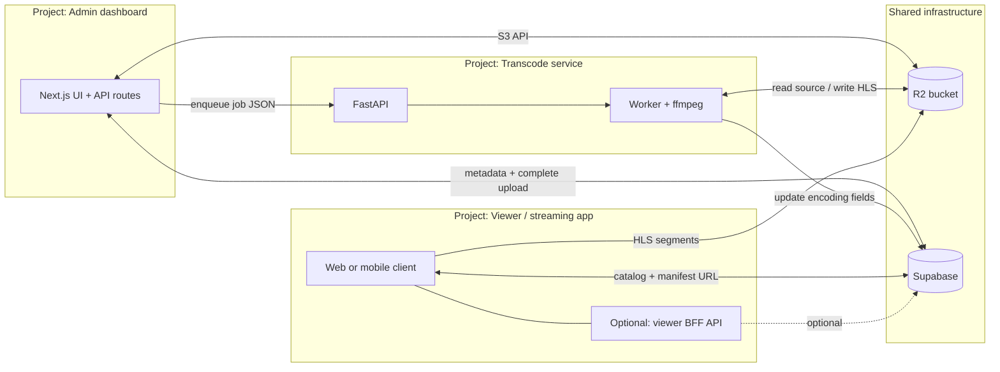
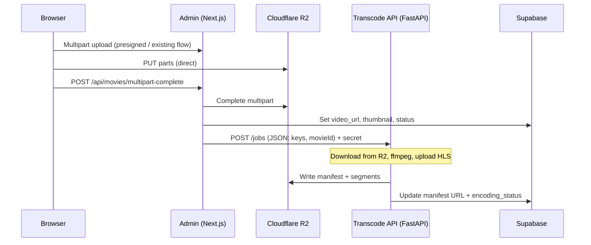
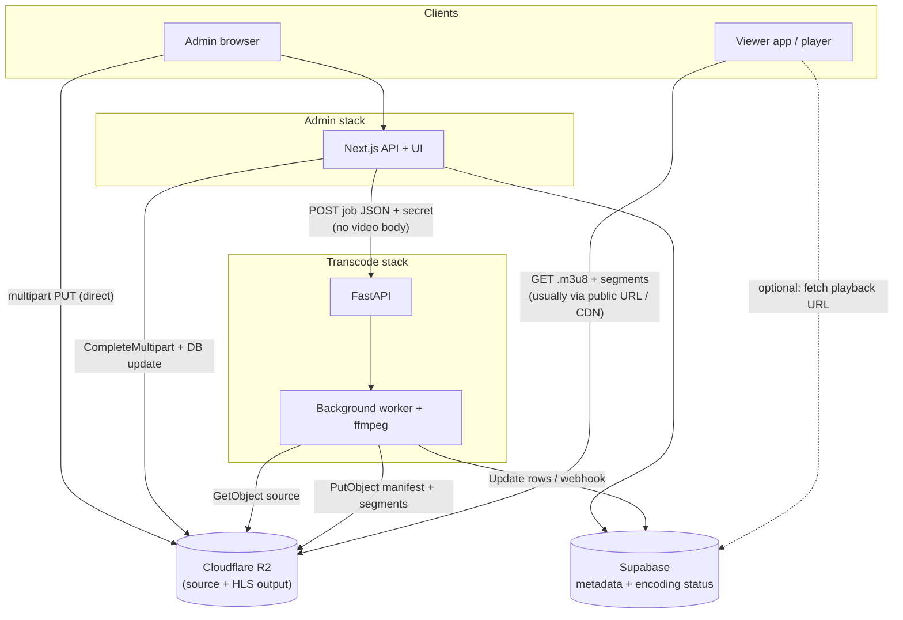
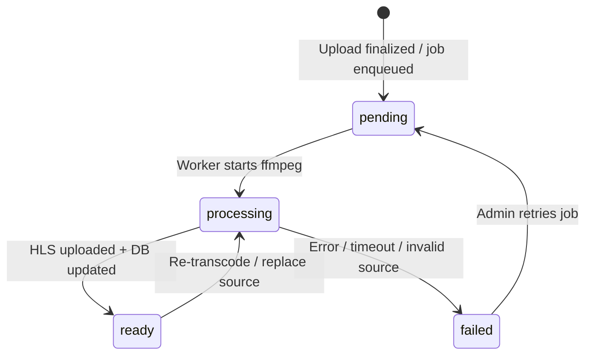

# Video transcoding implementation guide

This document describes how to add **adaptive bitrate (ABR)** playback—e.g. 1080p / 720p / 360p—on top of the current ReelTime admin flow. Today, uploads go **directly to Cloudflare R2** and `video_url` points at a **single** progressive file. Transcoding is **not** implemented in this repo yet; this is the blueprint.

## Goals

- Multiple renditions so slow networks can play lower bitrates without stalling.
- **HLS** (recommended) or DASH: a **manifest** (`.m3u8` / `.mpd`) plus segments; the player switches quality automatically.
- **Heavy work** runs outside Next.js (long CPU time, ffmpeg, large disk I/O).

## End-to-end flow (admin → transcode → viewer app)

Three separate systems: **this repo** (Next.js admin dashboard), **transcode service** (FastAPI + ffmpeg), and **viewer / consumer project** (your streaming app). Shared infrastructure: **R2** (files) and **Supabase** (metadata)—both projects read/write metadata as you design; the player loads video bytes from **public R2 (or CDN in front of R2)**.



### Three projects on one diagram (deployment view)



## Architecture overview



### System diagram (components & data flow)



### Encoding state (optional model for UI)



### What you should **not** do

- Do **not** stream the full video file **through** FastAPI from the browser. That duplicates bandwidth, hits body limits, and slows uploads.
- Do **not** run ffmpeg inside the `multipart-complete` request on Vercel/serverless: timeouts and memory will break first.

### What you **should** do

1. Keep the current pattern: browser → R2 for bytes; Next.js completes multipart and updates Supabase.
2. After the object exists in R2, the **server** (Next.js API route or the same handler after a successful complete) sends a **small JSON job** to the FastAPI service.
3. FastAPI (or a worker it triggers) reads the source from R2, transcodes, writes outputs back to R2, then updates Supabase (or calls a webhook your admin exposes).

## Separate project: FastAPI transcode service

Put ffmpeg and job logic in a **dedicated** Python service (FastAPI is a good fit):

- Own repository **or** a second package in a monorepo—your choice. What matters is a **separate deployable** (container/VM) with enough CPU, RAM, and ephemeral disk for ffmpeg.
- Expose a minimal HTTP API: e.g. `POST /transcode/jobs` that returns `202 Accepted` with a `job_id`, and optionally `GET /transcode/jobs/{id}` for status.

### Suggested job payload (server → FastAPI)

Send this from Next.js **after** upload is finalized (never from the browser with a shared secret):

```json
{
  "job_id": "uuid-generated-by-admin-or-worker",
  "kind": "single_movie",
  "movie_id": "uuid",
  "source_bucket": "your-r2-bucket",
  "source_key": "movies/<movie_id>/video.mp4",
  "output_key_prefix": "movies/<movie_id>/hls/",
  "webhook_url": "https://admin.example.com/api/internal/transcode-callback",
  "supabase_update": false
}
```

For **series**, include `episode_number` (or episode id) and keys under the same `movies/<movie_id>/` prefix (aligned with `validateKeyBelongsToMovie` in this repo: keys must start with `movies/{movieId}/`).

### Authentication

- Use a **shared secret** (e.g. `Authorization: Bearer <TRANSCODE_SERVICE_TOKEN>`) or mTLS between admin and transcode service.
- Rotate keys; never expose the transcode token to the browser.

### Worker behavior (inside FastAPI or a subprocess queue)

1. **Download** or stream the source object from R2 using S3-compatible credentials (same account as this admin app’s R2 config).
2. Run **ffmpeg** (and optionally **ffmpeg**’s HLS muxer or **shaka-packager**) to produce:
   - `master.m3u8` referencing variant playlists
   - Per-rendition playlists and segments (`.m4s` / `.ts` depending on your choice)
3. **Upload** all outputs under `output_key_prefix` with correct `Content-Type` for playlists and segments.
4. **Finalize state** in Supabase:
   - e.g. `hls_manifest_url` = public URL to `.../master.m3u8`
   - `encoding_status` = `ready` | `failed`
   - Optionally keep `video_url` as the original MP4 for fallback until the client app only uses HLS.

Exact columns depend on a migration you add to Supabase; this admin app currently stores `video_url` and `thumbnail_url` on `movies` (and `video_url` per row in `series_episodes`).

## Database fields (recommended)

Add (names illustrative—pick what matches your naming):

| Column | Purpose |
|--------|---------|
| `encoding_status` | `pending` / `processing` / `ready` / `failed` |
| `encoding_error` | Short message for admin UI |
| `hls_manifest_url` or `playback_url` | URL passed to the video player |
| `source_video_key` | Optional; R2 key of mezzanine if you want re-runs |

For episodes, mirror the same on `series_episodes` or a side table keyed by episode id.

## Hooking into this admin app (checklist)

1. **Env**: `TRANSCODE_SERVICE_URL`, `TRANSCODE_SERVICE_SECRET`.
2. **After success** in `app/api/movies/multipart-complete/route.ts` (and `series-multipart-complete` for each episode or one batch job): fire-and-forget or await a short `fetch` to FastAPI that only **enqueues** the job (prefer async so user-facing latency stays low).
3. **Admin UI**: show `encoding_status` on movie detail / list; poll or use Supabase realtime if you want live updates.
4. **Consumer app / player**: use **HLS** (e.g. hls.js, or native Safari) with `hls_manifest_url` when `encoding_status === 'ready'`.

## Deployment and operations

- **CPU**: transcoding is CPU-bound; size instances for peak **concurrent** jobs, not average traffic.
- **Disk**: ffmpeg needs scratch space roughly on the order of input + largest intermediate; use a large ephemeral volume or stream carefully.
- **Timeouts**: HTTP request to “start job” should return quickly; actual work runs in a background task, Celery/RQ, or a queue consumer.
- **Idempotency**: same `job_id` or deterministic output prefix should not corrupt existing objects; consider deleting old `hls/` prefix before re-run or use versioned paths.
- **Retries**: network blips to R2 are normal; retry with backoff; mark `failed` only after limits.

## Cost reminders (short)

- **Encoding**: billed as compute (your VM) or as vendor “minutes encoded.”
- **Storage**: multiple renditions + segments **increase** total bytes vs one MP4.
- **Egress**: viewers pull segments through your CDN/R2; ABR improves experience but total delivered data for a full watch is still “about one movie”; the win is fewer stalls and abandons.

## ffmpeg direction (not a copy-paste recipe)

- Define a **ladder** (e.g. 1080p / 720p / 480p / 360p) with target bitrates appropriate for your content.
- Output **HLS** with aligned segment boundaries across renditions if you want smooth switching (ffmpeg `-hls_time`, `-master_pl_name`, or multi-pass workflows).
- Test playback on **Chrome** (hls.js) and **Safari** (native HLS).

For production tuning, refer to current ffmpeg documentation and your target devices; parameters vary by codec (H.264 vs HEVC vs AV1) and licensing constraints.

## Summary

| Component | Responsibility |
|-----------|----------------|
| **This admin (Next.js)** | Auth, presigned/multipart upload, complete upload, update DB, **POST transcode job** (metadata only). |
| **R2** | Source object + transcoded output objects. |
| **FastAPI service** | ffmpeg, upload results, update DB or webhook. |
| **Supabase** | Metadata, encoding status, manifest URL for the player. |
| **Viewer app** | HLS-capable player using manifest URL when ready. |

This keeps uploads fast and cheap on the wire, and isolates transcoding cost and failure modes in a service you can scale independently.
